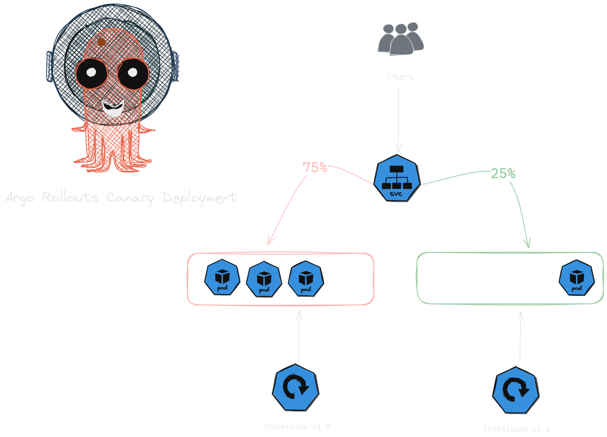

# Todo List Manager

## Overview:
A simple `multi-repo`, `microservice-based` todo list manager where users can create, read, update, and delete their todo lists and tasks.
This is an `event-driven pub-sub` architecture.

Each microservice is independably deployable, having it's own repository CI pipeline
 architecture.

> [!WARNING]There is a difference between a `distributed monolith` and a `microservices`

> [!TIPS]Use these 5 rules to check if you have a microservice.
1. Highly maintable and testable
2. Loosely coupled
3. Organized around business capabilities
4. Owned by a small team
5. Independently deployable (no need to co-ordinate releases across multiple microservice to deploy them together that is what we call a `distributed monolith`)

## Micro-Sevices (popular)
1. Publisher/Subscriber Architecture
2. Event Streaming Architecture
---
Event-Driven Architecture Benefits
* Decoupling
* Immutability
* Persistability
* Scalability
* Real-time Workflows
* Simplified Auditing
---
Event-Driven Architecture Challenges
1. Performance
2. Eventual Consistency
3. Complexity 

## Architecture

## Tech Stack
* Go
* Helm
* k8s
* kafka
* keda
* dappr
* CloudNativePG (Postgresql)
* Docker
* Prometheus
* Grafana
* Argo CD
* Argo Rollouts
* Github Actions

### IAC Pipelines
1. terraform repo (optional) we wont have this repo because we are not building in the cloud. We are building on local infrastructure using minikube. 
> [!NOTE]
I will create another gitops microservice project that has this the infrastructure running in AWS.

### Application Pipelines
1. frontend repo
2. users repo
3. todo repo

### Deployment Pipeline
4. k8s repo (aka config repo)

> [!TIP]
Deployment pipeline should always be triggered at the end of any of the CI pipeline
CI pipelines should submit a PR or push a change to the CD pipeline in order to update the image tag

Config repo applies k8s manifests config to our environment, it's usaully `Test/QA` environment.
Make sure you have observability on the all environments. eg (Prometheus and Grafana installed on the `Test/QA` environment).
We would usually have 3 environments.
1. TEST/QA
2. STAGING
3. PRODUCTION

GitOps pipelines can deploy to our environments in 2 different models 
1. Push model = `kubectl apply`
> [!NOTE]
We can allow the config repo to automatically apply changes to the testing env, however some companies mandate an Engineer to run the pipeline manually for `STAGING` and `PRODUCTION`.
2. Pull model(modern): Having an operator installed in our environments that pulls down our configurations.
> [!NOTE]
We would have an operator like ArgoCD installed in each of the k8s clusters, it basically checks drift between your `config repo` and `the state` of our clusters.
It can `automatically sync` or `manually sync changes`.

### Deployment type
We are using` Argo Rollouts Canary Deploy`.
The example below shows how canary deployment works for argo rollouts.
At first `100%` of traffic goes to the `original deployment` and then gradually the traffic will be moved over to the new version of the application. In this example are are using an increment of `5%` to the new version. Untll we have a `100%` of the traffic going to the new application.

